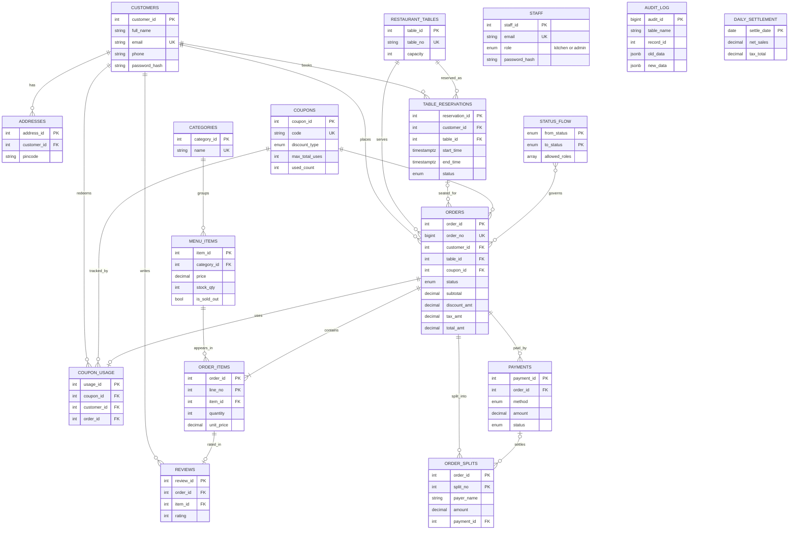
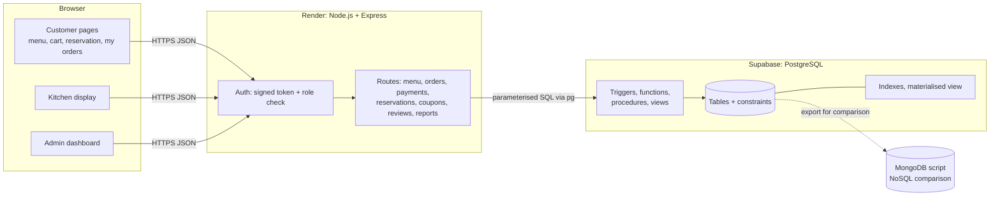
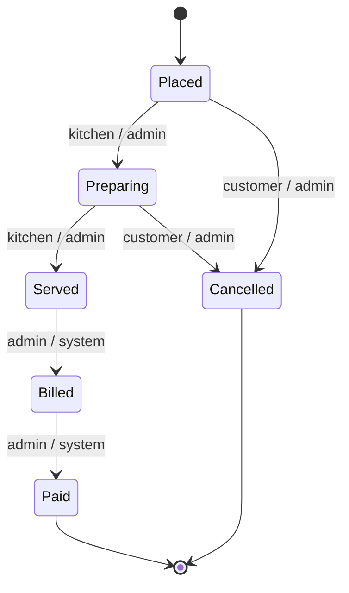

# DineFlow diagrams (Mermaid)

Paste each block into https://mermaid.live (or a GitHub .md preview) and export as PNG for the report.

## Figure 4.2: ER diagram

`staff`, `audit_log` and `daily_settlement` have no foreign keys by design: staff log in separately from customers, the audit log must survive deletions, and settlement rows are summaries.

## Figure 4.1: Architecture

## Figure 4.3: Order status flow (from `status_flow`)

